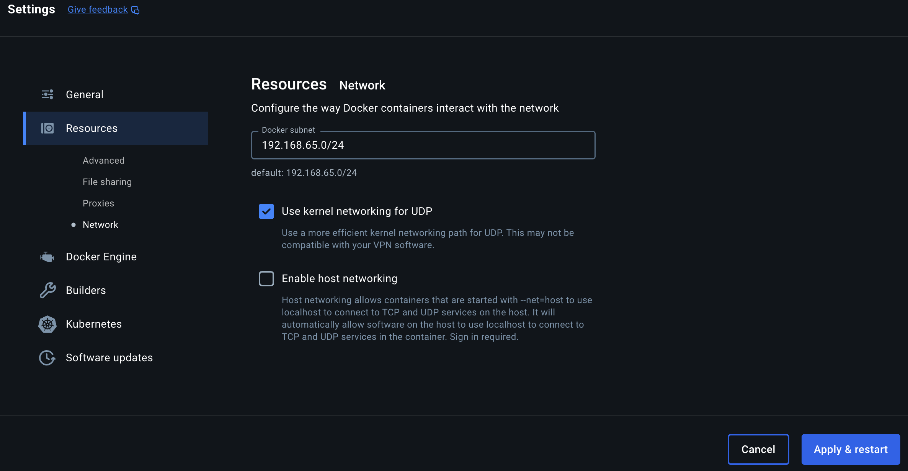

# docker-mac-routes

Routes IP traffic from MacOS host to docker containers in Docker Desktop. This script uses a feature `kernelForUDP` in Docker Desktop versions >= 4.26. When enabled, Docker Desktop creates a bridge interface on the MacOS `bridge101` and an interface `eth1` on the Desktop VM. This script piggybacks on this feature by adding local MacOS routes to route container network e.g. subnet `172.17.0.0/16` through interface `eth1` on the VM.

There are other approaches to achieve this e.g. [docker-mac-net-connect](https://github.com/chipmk/docker-mac-net-connect).
The purpose of this script is to be as simple as possible and to have no extra dependencies; being pure Bash and relying on standard cli tools only. Sudo rights are only asked for specific `route` commands and not the whole script.

## Script steps

- Initial checks that Docker and Docker Desktop is installed.
- Run a `busybox` container with `NET_ADMIN` privileges to query the IP of `eth1`.
- Query Docker networks.
- Add a route for every Docker network.

## How to run

Enable "kernel networking for UDP" in Docker Desktop from Settings->Resources->Network.


Run instantly with `curl` or `wget`:

```bash
curl -o- https://raw.githubusercontent.com/recap/docker-mac-routes/refs/tags/v0.1.0/docker-mac-routes-add.sh | bash
```

```bash
wget -qO- https://raw.githubusercontent.com/recap/docker-mac-routes/refs/tags/v0.1.0/docker-mac-routes-add.sh | bash

```

Or download the script and run it:

```bash
curl  -L https://github.com/recap/docker-mac-routes/archive/refs/tags/v0.1.0.tar.gz -o docker-mac-routes-0.1.0.tar.gz
tar -zxvf docker-mac-routes-0.1.0.tar.gz
cd docker-mac-routes-0.1.0
bash docker-mac-routes-add.sh

```

## Check routes

To check routes to a particular subnet on MacOS use `netstat` and grep for your subnets e.g.

```bash
netstat -nr | grep 172.17                                                                                                                                                                                                             (base)
```

## Test connectivity

Run a NGINX container and grab its container IP

```bash
docker run --rm --name test_nginx -d nginx
docker inspect test_nginx --format '{{.NetworkSettings.IPAddress}}'
```

Check if NGINX is reachable.

```bash
curl -I [container_ip]
```

Stop container

```bash
docker stop test_nginx
```

The script must be run every time Docker Desktop restarts or any changes are made to Docker networks e.g. Adding a new network.
